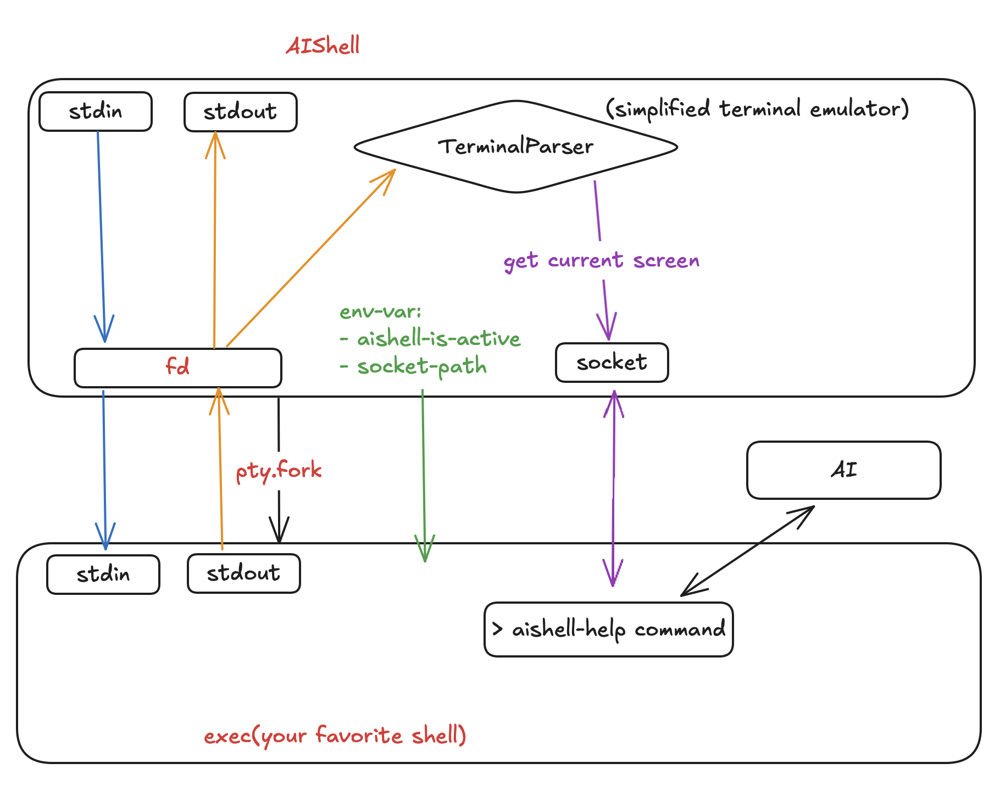

# AIShell ✨

AIShell is a transparent shell wrapper that allows you to build context-aware tools for your shell environment.




## Main Features

- It functions as a transparent shell wrapper, allowing you to use it like any other shell. The key difference is that it captures screen content, including the stdout and stderr of any command, which can then be passed to AI as context.

- `aishell-help` - AI-powered shell context analysis and assistance
- `aishell-quick-help` - Chat with AI without leaving your terminal (without context)


## Installation

```
git clone https://github.com/cccntu/aishell.git
cd aishell
pip install .
```

or 

```
pip install git+https://github.com/cccntu/aishell.git
```

## Usage

- For the tools to work, you need to first start AIShell.
   ```
   aishell
   ```
- Get AI help:
   ```
   aishell-help [--lines N] [--interactive]
   ```
   Analyzes the current shell context and provides AI-powered assistance. Use `--interactive` for a chat-like experience.


- Get quick help (without context):
   ```
   aishell-quick-help [<question>]
   ```
   Quickly get an answer to a shell-related question without leaving your terminal.

## Additional commands
- Get screen state:
   ```
   aishell-get-screen [--print] [--lines N] [--output FILE]
   ```
   Captures the current screen state. Use `--print` to display on stdout, `--lines` to limit output, and `--output` to specify a file.

## Supported shells 

- Currently tested on zsh, bash, and fish.


## Configuration

- AIShell currently only supports OpenAI API. Make sure to set your OpenAI API key (OPENAI_API_KEY) as an environment variable.
- Prompt is defined in `src/aishell/aishell_help.py`

## TODO

- Function Calling
- Configuration (model, prompt, etc)
- Support more API (contributions are welcome)
- Support more shells (contributions are welcome)
- Contribution and feedback are welcome!


## Contributing

Please open an issue before submitting a PR.


## License

MIT


## Acknowledgements

This project is inspired by the following projects:
- [github.com/nvbn/thefuck](https://github.com/nvbn/thefuck)
- [github.com/paul-gauthier/aider](https://github.com/paul-gauthier/aider)
- [github.com/VictorTaelin/ChatSH](https://github.com/VictorTaelin/ChatSH)

